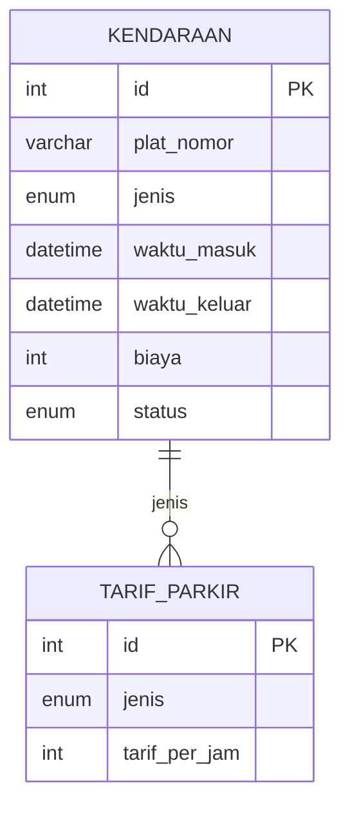

# 🚀 SmartPark - Sistem Manajemen Parkir Berbasis Web


**SmartPark** adalah solusi modern untuk manajemen parkir berbasis web dengan arsitektur MVC. Sistem ini menyederhanakan operasional parkir mulai dari input kendaraan, penentuan tarif, hingga analisis laporan keuangan - semuanya dalam satu platform terintegrasi!

<div align="center">
  
[](https://php.net/)
[](LICENSE)
[](https://github.com/username/smartpark)

</div>

## ✨ Fitur Unggulan

| Fitur | Deskripsi |
|-------|------------|
| 🚗 **Manajemen Kendaraan** | Input kendaraan masuk/keluar secara real-time |
| ⚙️ **Kelola Tarif Dinamis** | Update tarif parkir untuk motor & mobil dengan mudah |
| 📊 **Analitik Cerdas** | Laporan harian dengan filter dan statistik visual |
| 📱 **Responsif** | Akses dari desktop, tablet, atau smartphone |
| 📤 **Ekspor Data** | Unduh laporan dalam format CSV untuk analisis lanjutan |

## 🛠 Teknologi

**Backend**  


**Frontend**  


**Arsitektur**  


## 🖥️ Demo Aplikasi

| Halaman Dashboard | Halaman Kelola Tarif | Halaman Laporan |
|-------------------|----------------------|-----------------|
|  |  |  |
| Monitor kendaraan aktif secara real-time | Atur tarif parkir dengan antarmuka intuitif | Analisis statistik pendapatan dan kendaraan |

## 🚀 Panduan Instalasi

### Prasyarat Sistem
- PHP 7.4+
- MySQL 5.7+
- Web Server (Apache/Nginx)
- Composer (disarankan)

### Instalasi Langkah demi Langkah

```bash
# 1. Clone repositori
git clone https://github.com/username/smartpark.git
cd smartpark

# 2. Install dependencies
composer install

# 3. Buat database
mysql -u root -p -e "CREATE DATABASE smartpark;"

# 4. Import struktur database
mysql -u root -p smartpark < database/smartpark.sql

# 5. Konfigurasi environment
cp .env.example .env
```

Konfigurasi file `.env`:
```env
DB_HOST=localhost
DB_NAME=smartpark
DB_USER=root
DB_PASSWORD=rahasia
```

### Menjalankan Aplikasi
```bash
# Dengan PHP built-in server
php -S localhost:8000 -t public

# Atau dengan Apache/Nginx
# (Pastikan document root mengarah ke folder 'public')
```

Akses aplikasi di browser: [http://localhost:8000](http://localhost:8000)

## 🧩 Struktur Proyek

```markdown
smartpark/
├── app/
│   ├── controllers/    # Logic aplikasi
│   ├── models/         # Interaksi database
│   └── views/          # Template antarmuka
├── config/             # Konfigurasi sistem
├── public/             # Aset publik
│   ├── assets/
│   │   ├── css/        # Stylesheet
│   │   ├── js/         # Skrip JavaScript
│   │   └── images/     # Gambar
├── database/           # Skema dan data awal
├── vendor/             # Dependencies
├── router.php          # Routing aplikasi
└── index.php           # Entry point
```

## 🧪 Struktur Database



## 🤝 Berkontribusi

Kontribusi sangat diterima! Ikuti alur berikut:

1. Fork proyek ini
2. Buat branch fitur (`git checkout -b fitur/namafitur`)
3. Commit perubahan (`git commit -m 'Tambahkan fitur baru'`)
4. Push ke branch (`git push origin fitur/namafitur`)
5. Buat Pull Request

## 📜 Lisensi

Proyek ini dilisensikan di bawah [MIT License](LICENSE) - lihat file [LICENSE](LICENSE) untuk detailnya.

---

**SmartPark** © 2024 - Dibuat dengan ❤️ untuk sistem parkir yang lebih baik  
[](https://twitter.com/smartpark)
[](https://github.com/sponsors/username)